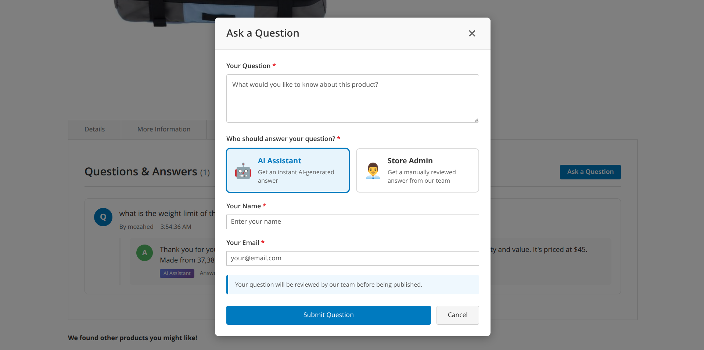

# Magento 2 Product Q&A with AI Assistant


A powerful Magento 2 module that enables customers to ask questions on product pages and receive **instant AI-generated answers** or admin-reviewed responses.

> 📌 **Version Management**: This repository uses branches for version control.  
> See [BRANCHES.md](BRANCHES.md) for installation by specific version.
> - **Latest**: `main` (v2.0.0 - AI-powered)
> - **Stable**: `release/2.0.0` (v2.0.0)
> - **Legacy**: `release/1.0.0` (v1.0.0 - Basic Q&A)

---

## 📸 Screenshots

### v2.0.0 - Customer Choice Modal
Choose between AI Assistant or Store Admin for your answer!



### v2.0.0 - AI-Generated Answers
See AI-generated answers with clear attribution badges!


### Admin Dashboard
Manage all customer questions from one place.


### Admin Grid View
Filter, search, and manage questions efficiently.


### Frontend - Questions on Product Page
Display questions and answers on product pages.


### Frontend - Question Submission Form (v1.0.0)
Simple question submission modal.


---

## ✨ Features

### 🤖 v2.0.0 - AI-Powered Answers (NEW!)

- **AI Assistant Integration**: Instant AI-generated answers using advanced language models
- **Customer Choice**: Let customers choose between AI Assistant or Store Admin answers
- **Smart Product Context**: AI receives full product information (name, SKU, description, price, attributes, categories)
- **Rule-Based Mode**: Intelligent template-based responses without requiring AI model download
- **Optional AI Model**: Support for Qwen 2.5-3B-Instruct with WebGPU acceleration
- **Visual Indicators**: Beautiful badges showing answer source (🤖 AI Assistant or 👨‍💼 Store Admin)
- **Retry Command**: CLI command to regenerate failed AI answers
- **100% Local**: No third-party APIs, complete privacy
- **Self-Contained**: AI service included in module (`ai-service/` folder)

### 📦 Core Features (All Versions)

- ✅ Customer questions on product pages
- ✅ Admin answer management dashboard
- ✅ Question approval workflow (Pending → Approved → Answered)
- ✅ Email notifications for customers and admins
- ✅ Status management system
- ✅ Customer name & email validation
- ✅ Responsive modal design with animations
- ✅ SEO-friendly Q&A display
- ✅ Grid filters and search in admin panel
- ✅ AJAX form submission (no page reload)
- ✅ Admin answer attribution
- ✅ Product association with questions

---

## 📋 Requirements

- **Magento**: 2.4.x
- **PHP**: 8.1, 8.2, or 8.3
- **Node.js**: 20.x or higher (for AI service)
- **Database**: MySQL 5.7+ or MariaDB 10.4+
- **Optional**: GPU with WebGPU support (for AI model acceleration)

---

## 🚀 Installation

### Quick Install

```bash
# Navigate to your Magento root directory
cd /path/to/magento2

# Clone the module
git clone https://github.com/Moozaheed/Megento-Product-QnA.git app/code/Vendor/ProductQnA

# Enable the module
php bin/magento module:enable Vendor_ProductQnA

# Run setup upgrade
php bin/magento setup:upgrade

# Compile dependency injection
php bin/magento setup:di:compile

# Deploy static content (if in production mode)
php bin/magento setup:static-content:deploy -f

# Clear cache
php bin/magento cache:flush
```

### AI Service Setup (Optional but Recommended)

The AI service can run in two modes:

1. **Rule-Based Mode** (default): No AI model required, instant intelligent responses
2. **AI Model Mode**: Download and use Qwen 2.5-3B-Instruct for higher quality answers

```bash
# Navigate to AI service directory
cd app/code/Vendor/ProductQnA/ai-service

# Install dependencies
npm install

# Start the AI service
node server.js

# Or run in background
nohup node server.js > ai-service.log 2>&1 &

# Or use PM2 for production
npm install -g pm2
pm2 start server.js --name productqna-ai
pm2 save
```

The AI service will run on `http://localhost:3000`

### Docker Environment Setup

If you're using Docker (like docker-compose), configure network access:

```bash
# 1. Find Docker gateway IP
docker network inspect <network_name> | grep Gateway
# Example output: "Gateway": "172.23.0.1"

# 2. Update AI service URL in Magento admin
# Go to: Stores > Configuration > Catalog > Product Q&A
# Set AI Service URL to: http://172.23.0.1:3000 (use your gateway IP)

# 3. Allow firewall access
sudo ufw allow from 172.23.0.0/16 to any port 3000
```

### Verify Installation

```bash
# Check module status
php bin/magento module:status Vendor_ProductQnA

# Check database tables
php bin/magento setup:db:status

# Test AI service (if enabled)
curl http://localhost:3000/health
# Should return: {"status":"ok","mode":"rule-based",...}
```

For detailed installation instructions, see **[INSTALL.md](INSTALL.md)**

---

## 📖 Usage

### For Customers

1. Navigate to any product page
2. Click **"Ask a Question"** button
3. Choose your answer preference:
   - 🤖 **AI Assistant**: Get instant AI-generated answer
   - 👨‍�� **Store Admin**: Get manually reviewed answer from store team
4. Fill in your question, name, and email
5. Submit and receive notification when answered

### For Admins

#### Managing Questions

1. Go to: **Catalog > Product Q&A > Manage Questions**
2. View all customer questions
3. Filter by status, product, date
4. Approve or reject questions
5. Answer questions manually

#### Retry Failed AI Answers

If some AI answers failed to generate:

```bash
php bin/magento productqna:retry-ai-answers
```

This command will:
- Find all questions with `answer_preference='ai'` that haven't been answered
- Retry AI answer generation
- Update question status to "Answered"

---

## 🗄️ Database Schema

### v2.0.0 Tables

#### `vendor_product_qna_question`
Main question table with v2.0.0 enhancements:
- **NEW**: `answer_preference` (varchar) - 'ai' or 'admin'
- Stores customer questions with their preferred answer type

#### `vendor_product_qna_answer`
Answer table with v2.0.0 enhancements:
- **NEW**: `is_ai_generated` (tinyint) - 1 for AI, 0 for admin
- **NEW**: `ai_answer_id` (int) - References AI answer details

#### `vendor_product_qna_ai_answer` (NEW in v2.0.0)
Stores AI-generated answer metadata:
- `ai_answer_id` - Primary key
- `question_id` - Links to question (UNIQUE constraint)
- `ai_model_name` - Model used (e.g., "Qwen/Qwen2.5-3B-Instruct")
- `ai_answer_text` - The generated answer
- `processing_time_ms` - Time taken to generate
- `status` - Answer status
- `created_at`, `updated_at` - Timestamps

---

## 🛠️ Configuration

### Admin Configuration Path
**Stores > Configuration > Catalog > Product Q&A**

### Configuration Options

| Option | Description | Default |
|--------|-------------|---------|
| Enable Module | Enable/disable the module | Yes |
| AI Service URL | URL of the AI answer service | http://localhost:3000 |
| Notification Email | Email for new question alerts | store email |
| Auto-approve Questions | Skip admin approval | No |
| Email Notifications | Send email to customers | Yes |

### AI Service Configuration

Edit `ai-service/server.js`:

```javascript
// Server configuration
const PORT = 3000;
const USE_AI_MODEL = false; // true for AI model, false for rule-based

// AI Model configuration (if USE_AI_MODEL = true)
const MODEL_NAME = 'Qwen/Qwen2.5-3B-Instruct';
```

---

## 🔧 CLI Commands

### Retry AI Answers
```bash
php bin/magento productqna:retry-ai-answers
```
Retries AI answer generation for questions that failed.

### Module Commands
```bash
# Enable module
php bin/magento module:enable Vendor_ProductQnA

# Disable module
php bin/magento module:disable Vendor_ProductQnA

# Check status
php bin/magento module:status Vendor_ProductQnA

# Upgrade database
php bin/magento setup:upgrade

# Clear cache
php bin/magento cache:flush
```

---

## 🐛 Troubleshooting

### AI Service Issues

**Problem**: AI service returns 503 errors

```bash
# Check if service is running
curl http://localhost:3000/health

# Check logs
tail -f app/code/Vendor/ProductQnA/ai-service/ai-service.log

# Restart service
pkill -f "node server.js"
node server.js
```

**Problem**: Docker containers can't reach AI service

```bash
# Use Docker gateway IP instead of localhost
# Find gateway IP:
docker network inspect your_network | grep Gateway

# Update config to use gateway IP (e.g., 172.23.0.1:3000)
```

**Problem**: Firewall blocking AI service

```bash
# Allow Docker network
sudo ufw allow from 172.23.0.0/16 to any port 3000

# Or allow from localhost only
sudo ufw allow from 127.0.0.1 to any port 3000
```

### Module Issues

**Problem**: Questions not appearing on product page

```bash
# Clear cache
php bin/magento cache:flush

# Recompile
php bin/magento setup:di:compile

# Deploy static content
php bin/magento setup:static-content:deploy -f
```

**Problem**: CSS/styling broken

```bash
# Remove static files and cache
rm -rf pub/static/frontend/* var/view_preprocessed/*
php bin/magento cache:flush

# Hard refresh browser (Ctrl+Shift+R)
```

**Problem**: Database upgrade needed

```bash
# Run upgrade
php bin/magento setup:upgrade
php bin/magento cache:flush
```

---

## 📊 Performance

- **Rule-based mode**: ~50-100ms response time
- **AI model mode**: ~2-5 seconds (first load), ~500ms-1s (subsequent)
- **Database**: Optimized indexes on frequently queried columns
- **Caching**: Full page cache compatible

---

## 🔄 Upgrade from v1.x to v2.0.0

```bash
# 1. Backup database first!
php bin/magento setup:backup --db

# 2. Pull latest code
git pull origin main

# 3. Run upgrade (this adds new columns and tables)
php bin/magento setup:upgrade

# 4. Recompile
php bin/magento setup:di:compile

# 5. Clear cache
php bin/magento cache:flush

# 6. Deploy static content (if in production mode)
php bin/magento setup:static-content:deploy -f

# 7. Install AI service (optional)
cd app/code/Vendor/ProductQnA/ai-service
npm install
node server.js
```

**Note**: v2.0.0 is 100% backward compatible - all v1.0.0 features work as before!

---

## 📝 Changelog

### v2.0.0 (2026-02-06)

#### Added
- ✨ **AI-powered answer generation**
- ✨ **Customer choice between AI and Admin answers**
- ✨ **Rule-based answer mode** (no AI model required)
- ✨ **Optional AI model integration** (Qwen 2.5-3B-Instruct)
- ✨ **AI answer tracking and metadata table**
- ✨ **CLI command to retry failed AI answers**
- ✨ **Visual badges for answer source**

#### Changed
- 🔧 **Enhanced product context** for AI
- 🔧 **Improved modal UI** with radio buttons and animations

#### Fixed
- 🐛 **Foreign key constraint issues**
- 🐛 **Modal z-index** (appears above all elements)
- 🐛 **Docker network connectivity** documentation

### v1.0.0 (2025-01-15)
- Initial release
- Basic Q&A functionality
- Admin management panel
- Email notifications

For detailed changes, see **[CHANGELOG.md](CHANGELOG.md)**

---

## 🤝 Contributing

Contributions are welcome! Please follow these steps:

1. Fork the repository
2. Create your feature branch (`git checkout -b feature/AmazingFeature`)
3. Commit your changes (`git commit -m 'Add some AmazingFeature'`)
4. Push to the branch (`git push origin feature/AmazingFeature`)
5. Open a Pull Request

See **[BRANCHES.md](BRANCHES.md)** for branching strategy.

---

## 📄 License

This project is licensed under the MIT License.

---

## 👨‍💻 Author

**Moozaheed**
- GitHub: [@Moozaheed](https://github.com/Moozaheed)
- Repository: [Megento-Product-QnA](https://github.com/Moozaheed/Megento-Product-QnA)
- Email: giyasmahmudmozahed@gmail.com

---

## 🙏 Acknowledgments

- Magento 2 Community
- Transformers.js for AI capabilities
- All contributors and users

---

## 📞 Support

For issues, questions, or suggestions:

- **Issues**: [GitHub Issues](https://github.com/Moozaheed/Megento-Product-QnA/issues)
- **Email**: giyasmahmudmozahed@gmail.com
- **Documentation**: 
  - [README.md](README.md) - This file
  - [INSTALL.md](INSTALL.md) - Quick installation guide
  - [CHANGELOG.md](CHANGELOG.md) - Version history
  - [BRANCHES.md](BRANCHES.md) - Branching strategy

---

**⭐ If you find this module helpful, please star the repository!**

---

## 📚 Additional Resources

- **Magento DevDocs**: https://devdocs.magento.com/
- **Magento Forums**: https://community.magento.com/
- **AI Service Documentation**: [ai-service/README.md](ai-service/README.md)

---

Made with ❤️ for the Magento Community
