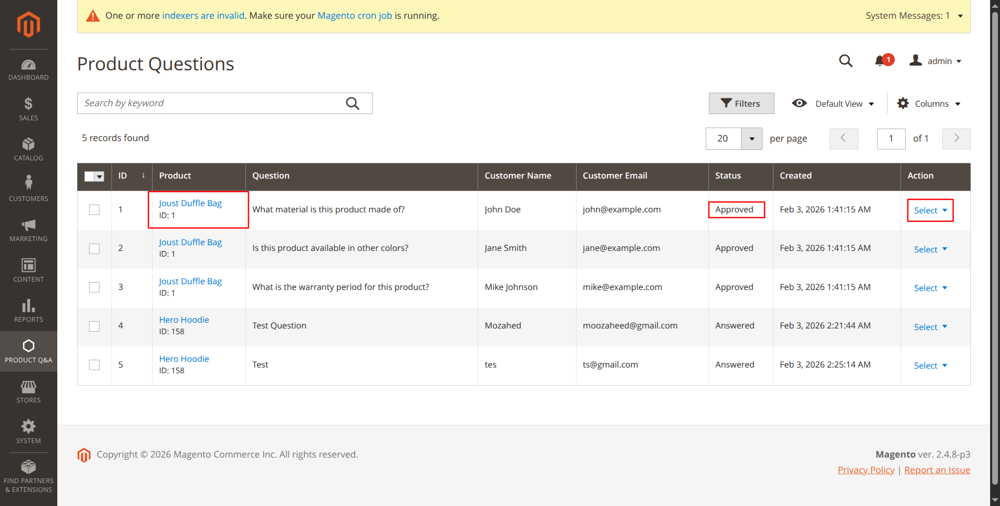

# Magento 2 Product Q&A Module

A comprehensive Product Questions & Answers module for Magento 2 that allows customers to ask questions about products and administrators to provide answers.

## 📸 Screenshots

### Admin Side View


### Admin Dashboard


### Frontend - Product Page


### Frontend - Ask Question Modal


## �📋 Features

### Customer Features
- ✅ Ask questions on product pages
- ✅ View approved and answered questions with answers
- ✅ See admin attribution on answers (shows who answered)
- ✅ Modern modal-based question submission form
- ✅ AJAX form submission (no page reload)
- ✅ Clean, responsive UI design

### Admin Features
- ✅ Comprehensive question management grid
- ✅ Filter and search questions
- ✅ View product links directly from grid
- ✅ Answer questions with rich text editor
- ✅ Edit existing answers
- ✅ Complete workflow management:
  - **Pending** → Approve, Answer, Archive
  - **Approved** → Answer, Archive
  - **Answered** → Edit Answer, Archive
  - **Archived** → Approve, Set to Pending
- ✅ Admin attribution tracking (records who answered)
- ✅ Bulk actions support
- ✅ Question approval/rejection system

### Technical Features
- ✅ Full database schema with proper relationships
- ✅ RESTful API interfaces
- ✅ UI Component grid with advanced filtering
- ✅ Dependency injection configuration
- ✅ ACL (Access Control List) support
- ✅ Multiple status states (Pending, Approved, Answered, Archived)
- ✅ Foreign key constraints with cascade delete
- ✅ Helpful count tracking (future enhancement ready)

## 📦 Installation

### Method 1: Manual Installation (Recommended for Development)

1. **Download/Clone the module:**
   ```bash
   cd <magento_root>/app/code
   mkdir -p Vendor/ProductQnA
   # Copy all module files to app/code/Vendor/ProductQnA
   ```

2. **Enable the module:**
   ```bash
   php bin/magento module:enable Vendor_ProductQnA
   php bin/magento setup:upgrade
   php bin/magento setup:di:compile
   php bin/magento setup:static-content:deploy -f
   php bin/magento cache:flush
   ```

3. **Set proper permissions:**
   ```bash
   chmod -R 777 var/ generated/ pub/static/
   ```

### Method 2: Composer Installation (For Production)

1. **Add repository to composer.json** (if publishing to Packagist):
   ```bash
   composer require vendor/module-productqna:^1.0
   ```

2. **Enable and install:**
   ```bash
   php bin/magento module:enable Vendor_ProductQnA
   php bin/magento setup:upgrade
   php bin/magento setup:di:compile
   php bin/magento setup:static-content:deploy -f
   php bin/magento cache:flush
   ```

### Docker Installation

If running Magento in Docker:
```bash
docker-compose run --rm deploy magento-command module:enable Vendor_ProductQnA
docker-compose run --rm deploy magento-command setup:upgrade
docker-compose run --rm deploy magento-command setup:di:compile
docker-compose run --rm deploy magento-command cache:flush
```

## 🗄️ Database Schema

The module creates 3 tables:

### 1. vendor_product_qna_question
| Column | Type | Description |
|--------|------|-------------|
| question_id | INT | Primary Key |
| product_id | INT | Foreign Key to catalog_product_entity |
| customer_id | INT | Customer ID (nullable) |
| customer_name | VARCHAR(255) | Customer name |
| customer_email | VARCHAR(255) | Customer email |
| question_text | TEXT | Question content |
| status | TINYINT | 0=Pending, 1=Approved, 2=Rejected, 3=Answered, 4=Archived |
| helpful_count | INT | Number of helpful votes |
| visibility | TINYINT | 1=Public, 0=Private |
| created_at | TIMESTAMP | Creation timestamp |
| updated_at | TIMESTAMP | Update timestamp |

### 2. vendor_product_qna_answer
| Column | Type | Description |
|--------|------|-------------|
| answer_id | INT | Primary Key |
| question_id | INT | Foreign Key to vendor_product_qna_question |
| admin_user_id | INT | Admin user who answered |
| answer_text | TEXT | Answer content |
| status | TINYINT | 0=Pending, 1=Published |
| created_at | TIMESTAMP | Creation timestamp |
| updated_at | TIMESTAMP | Update timestamp |

### 3. vendor_product_qna_helpful
| Column | Type | Description |
|--------|------|-------------|
| helpful_id | INT | Primary Key |
| question_id | INT | Foreign Key to vendor_product_qna_question |
| customer_id | INT | Customer who voted |
| ip_address | VARCHAR(45) | IP address |
| created_at | TIMESTAMP | Creation timestamp |

## 🎯 Usage

### For Customers

1. Navigate to any product page
2. Click on the "Questions & Answers" tab
3. Click "Ask a Question" button
4. Fill in the modal form with your question
5. Submit and wait for admin approval/answer

### For Administrators

1. **Access the module:**
   - Navigate to: **Admin Panel → Product Q&A → Manage Questions**

2. **Question Workflow:**

   **For Pending Questions:**
   - Click "Approve" to make visible on frontend
   - Click "Answer" to provide an answer (auto-approves)
   - Click "Archive" to hide from frontend
   - Click "Delete" to remove permanently

   **For Approved Questions:**
   - Click "Answer" to provide an answer
   - Click "Archive" to hide from frontend
   - Click "Delete" to remove permanently

   **For Answered Questions:**
   - Click "Edit Answer" to modify your answer
   - Click "Archive" to hide from frontend
   - Click "Delete" to remove permanently

   **For Archived Questions:**
   - Click "Approve" to restore and make visible
   - Click "Set to Pending" to move back to review
   - Click "Delete" to remove permanently

3. **Answering Questions:**
   - Click "Answer" or "Edit Answer" button
   - View question details and product information
   - See existing answers (if any)
   - Enter your answer in the text area
   - Click "Submit Answer" or "Update Answer"
   - Your name will be displayed as the answerer on frontend

## 🔧 Configuration

### ACL Permissions
The module includes ACL configuration. You can assign permissions via:
**System → Permissions → User Roles**

Resource: `Vendor_ProductQnA::questions`

## 📁 File Structure

```
app/code/Vendor/ProductQnA/
├── Api/
│   └── Data/
│       ├── AnswerInterface.php
│       └── QuestionInterface.php
├── Block/
│   ├── Adminhtml/
│   │   └── Question/
│   │       └── Answer.php
│   ├── Product/
│   │   └── View/
│   │       └── Questions.php
│   └── Question/
│       └── Form.php
├── Controller/
│   ├── Adminhtml/
│   │   └── Question/
│   │       ├── Answer.php
│   │       ├── Approve.php
│   │       ├── Archive.php
│   │       ├── Delete.php
│   │       ├── EditAnswer.php
│   │       ├── Index.php
│   │       ├── Pending.php
│   │       └── SaveAnswer.php
│   └── Question/
│       ├── Form.php
│       └── Save.php
├── etc/
│   ├── adminhtml/
│   │   ├── menu.xml
│   │   └── routes.xml
│   ├── frontend/
│   │   └── routes.xml
│   ├── acl.xml
│   ├── db_schema.xml
│   ├── di.xml
│   └── module.xml
├── Model/
│   ├── ResourceModel/
│   │   ├── Answer/
│   │   │   └── Collection.php
│   │   ├── Question/
│   │   │   ├── Collection.php
│   │   │   └── Grid/
│   │   │       └── Collection.php
│   │   ├── Answer.php
│   │   └── Question.php
│   ├── Source/
│   │   └── QuestionStatus.php
│   ├── Answer.php
│   └── Question.php
├── Ui/
│   └── Component/
│       └── Listing/
│           └── Column/
│               ├── ProductLink.php
│               └── QuestionActions.php
├── view/
│   ├── adminhtml/
│   │   ├── layout/
│   │   │   ├── productqna_question_answer.xml
│   │   │   └── productqna_question_index.xml
│   │   ├── templates/
│   │   │   └── question/
│   │   │       └── answer.phtml
│   │   └── ui_component/
│   │       └── productqna_question_listing.xml
│   └── frontend/
│       ├── layout/
│       │   └── catalog_product_view.xml
│       └── templates/
│           ├── product/
│           │   └── view/
│           │       └── questions.phtml
│           └── question/
│               └── form.phtml
├── composer.json
├── registration.php
└── README.md
```

## 🚀 Publishing to GitHub/Packagist

### 1. Create GitHub Repository

```bash
cd app/code/Vendor/ProductQnA
git init
git add .
git commit -m "Initial commit: Magento 2 Product Q&A Module v1.0.0"
git branch -M main
git remote add origin https://github.com/yourusername/magento2-productqna.git
git push -u origin main
```

### 2. Create Release Tag

```bash
git tag -a v1.0.0 -m "Release version 1.0.0"
git push origin v1.0.0
```

### 3. Publish to Packagist

1. Go to https://packagist.org
2. Click "Submit"
3. Enter your GitHub repository URL
4. Packagist will automatically sync releases

### 4. Update composer.json for Packagist

Change the name to match your GitHub username:
```json
{
    "name": "yourusername/magento2-productqna",
    "description": "Product Questions & Answers module for Magento 2",
    "type": "magento2-module",
    "version": "1.0.0",
    "license": "MIT"
}
```

## 🔄 Updates & Changelog

### Version 1.0.0 (Initial Release)
- Complete question and answer system
- Admin panel with grid management
- Frontend question submission form
- Answer workflow with admin attribution
- Status-based workflow (Pending → Approved → Answered → Archived)
- Product linking in admin grid
- AJAX form submission
- Responsive UI design

## 🐛 Troubleshooting

### Module not showing in admin
```bash
php bin/magento module:enable Vendor_ProductQnA
php bin/magento setup:upgrade
php bin/magento cache:flush
```

### Permission issues
```bash
chmod -R 777 var/ generated/ pub/static/
chown -R www-data:www-data var/ generated/ pub/static/
```

### Grid not loading
```bash
php bin/magento setup:di:compile
php bin/magento cache:flush
```

### Frontend not showing questions tab
- Clear cache
- Check if questions exist with status "Approved" or "Answered"
- Check browser console for JavaScript errors

## � Author

**G. M. Mozahed**  
Software Engineer at Brain Station 23

## 🤝 Support

For issues, questions, or contributions, please contact:  
📧 Email: giyasmahmudmozahed@gmail.com

## 🤝 Contributing

1. Fork the repository
2. Create your feature branch
3. Commit your changes
4. Push to the branch
5. Create a Pull Request

## 🙏 Credits

Built with Magento 2 best practices and standards.
